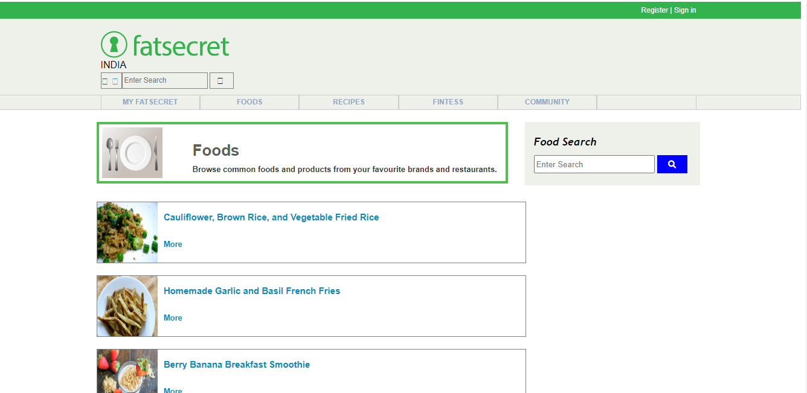

<h1 align="center"> Hi, Everyone <a href="https://comfy-semolina-1501da.netlify.app/" target="_blank"> Welcome </a></h1>
<h3 align="center" >-----  Created A clone of  -----</h3>
<h1 align="center"><a href="https://comfy-semolina-1501da.netlify.app/" target="_blank"> Fatsecret.com</a></h1>

About
This clone website is part of our first project in masai school where we have to create a Replica of Fatsecret.com which is one of the Weight Loss website which was reported to have the highest 30 day user retention rate of top Calorie Counter + Meal Planner for Weight Loss app And completed the project in just 5 days before the deadline.

<h2 align="left"><i>Tech Stack Use for Creating a Fatsecret.com clone</i></h2>

 

<h2 align="left"><i>You can find Deploy link here</i></h2>
<h3 align="left"><a href="https://starlit-klepon-070419.netlify.app/" target="_blank"> Fatsecret.com ( https://starlit-klepon-070419.netlify.app)</a></h3>

<h2>Team Members<h2>

1.Abhay Faldu 

2.Koteswararao 

3.Sammyak Deosale

4.Shivam kumar singh 

<h2>Key Learning From Project</h2>

Got more Idea about implementing a HTML and CSS.

Cleared idea about how JavaScript ES6 concept use.

learn better use of Github for shearing a work.

Learn how to work with team.

learn how More effient way to plan a work.

project to biuld a more communication skills and also filled a communication gaps

<h2 align="left"><i> We Use Deploy tool:</i></h2>

  

<h2>Responsibilities<h2>
<h4> Koteswararao </h4>
  
 Created a landing page with cool features:-

      <ul>
        <li>On hover Navbar</li>
        <li>Search bar</li>
        <li>Footer</li>
      </ul>
      
      

 

  
  
  
  
 

  
<h1 align="center">  Thank You  </h1>
